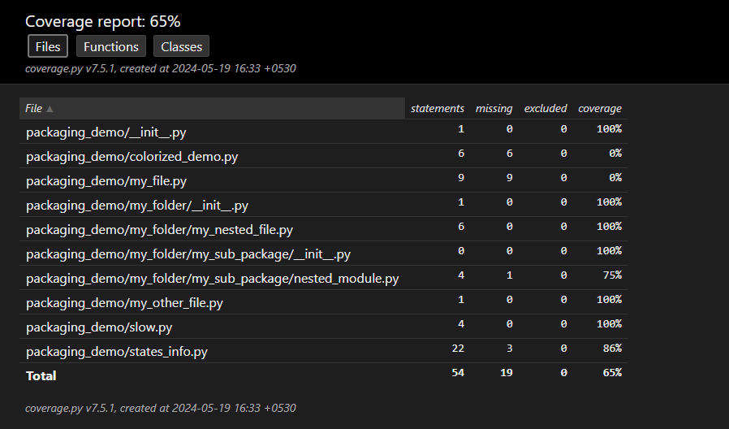

## Testing

- **Tests should be black box as much as possible:**
  - When optimizing/changing the code implementation that produces the same
    output as before, the test cases for that function should not get affected by
    this change. This what we mean by **balck box**.

  - **Tests should always test the behaviour of code, instead of implementation of
    behaviours.**

  - Tests that are not inline with above, are called **brittle tests**.


- **Test Case Universe**
  - The universe is the set of all possible test cases or all possible inputs
    that we could run through a function in testing.

  - But there are many tests for which it is infeasible to think/write all the
    possible test cases.

- **Unit Test**
  - A unit test is a type of test that tests one very specific thing or set differently.
    It tests a single unit of your code base that could be a single unit of your app's
    functionality, or it could be a single unit of code, like literally a single
    function or a single class.

  - **Why unit test?**
    - The behind idea that is if your test is only testing one thing and then that test
      suddenly fails to run, you have a pretty good idea of what caused that test to fail.

    - Whereas if you have a complex test that's running 20 different functions that you wrote,
      and then the test fails, you don't know which of those 20 functions failed or if some
      interaction between those functions caused them to fail.

  - The convention is that for each piece/unit of code we write a test specific to that unit.

  - So, a good way to organize our tests would be to have a parallel folder structure that
    mirrors what our packages folder file structure, in our test folder too.


- **Test Coverage**
  - In blak box testing, when we write our tests and our tests do try to test for behaviors
    instead of implementations of behaviors.

  - So we probably want enough tests at least to check in an automated way that
    all of the core behaviors of our code base are still intact.

  - Tests that tests the core functionality of our package/app, etc. are much more important
    to implement than the more granular unit tests for private modules in the codebase that
    aren't publicly exposed.

  - However, tests that do check the behaviors on invisible or non exposed parts of your codebase still
    do have some value, and that is if you have tests, then people who go to modify your code will be
    less afraid to try and modify your code because they'll be able to check to see if their modifications
    actually broke the particular unit of code that they're working on.

  - One check or test that is nice to implement is to check that every single line of our source
    code gets executed.

  - **Test Coverage reports does exactly the above, it tells the percentage of lines of your program
    that actually got executed.**

  - Tools to generate coverage report:
    - [Coverage.py](https://coverage.readthedocs.io/en/7.5.1/)
    - [pytest-cov](https://pytest-cov.readthedocs.io/en/latest/): Wrapper around coverage.py for pytest
      - `pip install pytest-cov`

  - Generating Coverage Report using `pytest-cov`:
    ```bash
    # get help: pytest --help

    python -m pytest "${THIS_DIR}/tests/" \
        --cov "${THIS_DIR}/packaging_demo" \
        --cov-report html

    # python -m pytest <tests_dir> --cov <source_code_dir> --cov-report <report_type>

    # To see the html report, run a local python server
    python -m http.server -d "<path to htmlcov dir generated by pytest-cov>"
    ```

    


  - Optimizing for 100% Test Coverage is not always helpful

    - It is possible that you could have 100% test coverage and that your tests not
      actually be testing the functionality of the code.

    - So you could have 100% test coverage and your program could be completely broken,
      like, yes, we executed it, but at the minimum, all executing does is verify that
      we don't have syntax errors or something, or that we don't run into a case where
      we raise an exception.

    - There is a marginal increase in number of tests that we may have to write to attain
      100% test coverage of our codebase. And it's not worth developer's time because along
      with our source code we would have to maintain our test suite too.

    - We can enforce a minimum threshold for our test coverage, say 75% or 80% for our codebase.
      The threshold is subjective to each codebase and decided by the developer.

      ```bash
      pytest --help
      >>> --cov-fail-under=MIN  Fail if the total coverage is less than MIN.
      ```

## Testing in GitHub Actions

- In github actions each time you run a workflow it's run on a fresh linux machine(a docker container).

- So, what is it going to take to execute our tests on a fresh Linux machine?

- Well, we're probably going to need our code because our code contains the tests and it also contains the source code, although we wouldn't really want to test our source code inside `packaging_demo` folder.

- And the reason why is because it's not actually our source code that we want to test. Or in other words, if we clone our repository, what we want to test isn't actually the code that's here in `packaging_demo`.

- Testing the source code works well for local development but it's not going to be great for running in GitHub Actions.

- But what we should really be testing is the version of our code that our customers are going to be using. And so it isn't this code that we want to test, we want to test is actually the package that we build, the distribution package that we build, aka the wheel or the source distribution.

- Another reason for testing the whl package that we built is, there are number of ways in which we can mess up or break the wheel that gets build. Remember, a wheel file is just a zipped file containing our source code or pre-complied binaries.
  - So, for example when you build a wheel, you might have accidentally left out a `__init__.py` in one of your source folder. And so when the wheel gets built, an entire subdirectory of your code could not be included in the wheel.

  - Or you might have missed to include a necessary data file in the wheel due to configuration mistakes in our `pyproject.toml` file, for example in our case it might be `cities.json`


- So, since we're vending our source code as a package which is going to end up on Pypi, it's the packaged version of our code that we want to test.


  ```yaml
    execute-tests:
      needs:
        - build-wheel-and-sdist
      runs-on: ubuntu-latest
      steps:
      - uses: actions/checkout@v3
      - name: Set up Python 3.8
        uses: actions/setup-python@v4
        with:
          python-version: 3.8

      - name: Download wheel and sdist
        uses: actions/download-artifact@v4
        with:
          name: wheel-and-sdist-artifact
          path: ./dist/

      - name: Install test dependencies
        run: |
          pip install pytest pytest-cov ./dist/*.whl
      - name: Testing the build wheel
        run: |
          /bin/bash -x run.sh test:ci
  ```

- The below test function determines the path where our built package is installed(`INSTALLED_PKG_DIR`),
  and then points that source code to pytest to test on it(`--cov "$INSTALLED_PKG_DIR"`).

  ```bash
  # run.sh
  # the test:ci function
  function test:ci {
      PYTEST_EXIT_STATUS=0

      # Determine the installed package directory by using Python to import the package and print its path
      INSTALLED_PKG_DIR="$(python -c 'import packaging_demo; print(packaging_demo.__path__[0])')"

      python -m pytest "${@:-$THIS_DIR/tests/}" \
          --cov "$INSTALLED_PKG_DIR" \
          --cov-report html \
          --cov-report term \
          --cov-report xml \
          --junit-xml "$THIS_DIR/test-reports/report.xml" \
          --cov-fail-under 60 || ((PYTEST_EXIT_STATUS+=$?))

      mv coverage.xml "$THIS_DIR/test-reports/"
      mv htmlcov "$THIS_DIR/test-reports/"
      mv .coverage "$THIS_DIR/test-reports/"

      return $PYTEST_EXIT_STATUS
  }
  ```

- **So this is how tests are performed in GitHub CI.**
